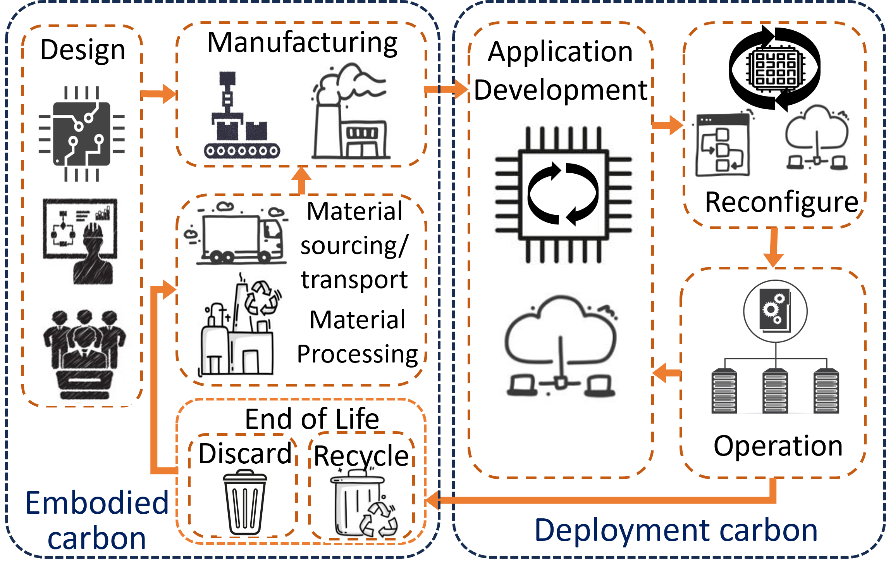
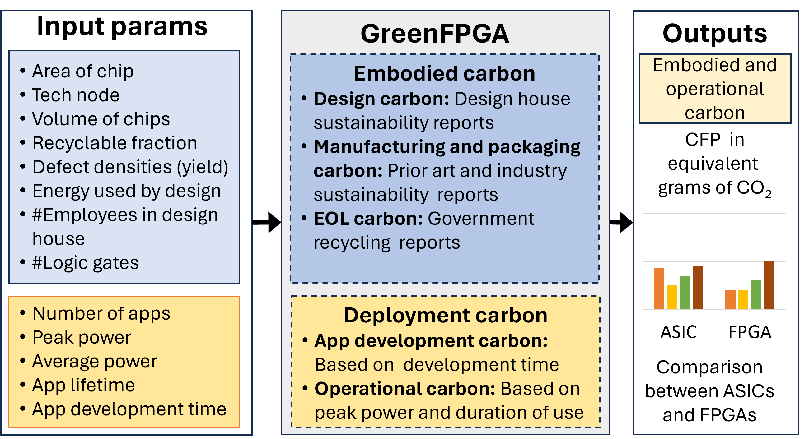
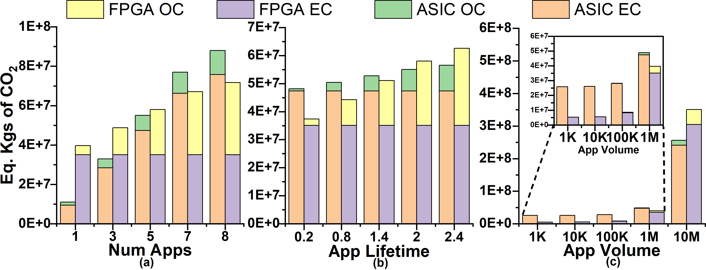
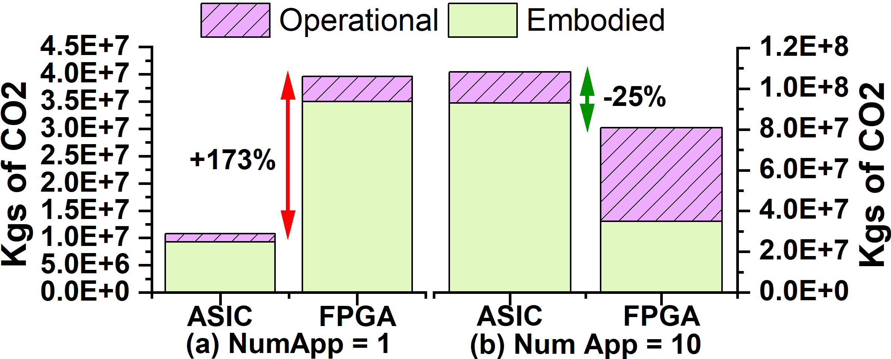

# GreenFPGA

Tool to evaluate the carbon footprint of FPGA-based computing across its lifetime. The tool can also perform comparisons with ASIC counterpart considering differnt aspects such as manufacturing, recycling, disposal, reconfigurability (reuse), operation and design. The sustainable benifits of FPGA compared to ASIC is shown in this work.

  

  


## Abstract

## Table of Contents

-   [Directory structure](#directory-structure)
-   [Getting started](#getting-started)
-   [Key parameters](#key-parameters)
-   [Running GreenFPGA](#running-greenfpga)
-   [Outputs](#outputs)

## Directory Structure 

- **src/**
  - [CO2_func.py](./src/CO2_func.py)
  - [ECO_chip.py](./src/ECO_chip.py)
  - [tech_scaling.py](./src/tech_scaling.py)
- **tech_params**
  - [beol_feol_scaling.json](./tech_params/beol_feol_scaling.json)
  - [cpa_scaling.json](./tech_params/cpa_scaling.json)
  - [defect_density.json](./tech_params/defect_density.json)
  - [dyn_pwr_scaling.json](./tech_params/dyn_pwr_scaling.json)
- [README.md](README.md)
- **test_example**
  - **Agilex**
    - [spec.json](./test_example/Agilex/spec.json)
    - [green_fpga_param.json](./test_example/Agilex/green_fpga_param.json)
    - [node_list.txt](./test_example/Agilex/node_list.txt)
  - **ASIC_analysis**
    - [spec.json](./test_example/ASIC_analysis/spec.json)
    - [green_fpga_param.json](./test_example/ASIC_analysis/green_fpga_param.json)
    - [node_list.txt](./test_example/ASIC_analysis/node_list.txt)
  - **FPGA_analysis**
    - [spec.json](./test_example/FPGA_analysis/spec.json)
    - [green_fpga_param.json](./test_example/FPGA_analysis/green_fpga_param.json)
    - [node_list.txt](./test_example/FPGA_analysis/node_list.txt)
  - **Moffett**
    - [spec.json](./test_example/Moffett/spec.json)
    - [green_fpga_param.json](./test_example/Moffett/green_fpga_param.json)
    - [node_list.txt](./test_example/Moffett/node_list.txt)
  - **Stratix**
    - [spec.json](./test_example/Stratix/spec.json)
    - [green_fpga_param.json](./test_example/Stratix/green_fpga_param.json)
    - [node_list.txt](./test_example/Stratix/node_list.txt)
  - **TPU**
    - [spec.json](./test_example/TPU/spec.json)
    - [green_fpga_param.json](./test_example/TPU/green_fpga_param.json)
    - [node_list.txt](./test_example/TPU/node_list.txt)
- **images**
  - [asic_fpga_app.png](./images/asic_fpga_app.png)
  - [dnn.png](./images/dnn.png)
  - [fpga-ligecycle.png](./images/fpga-lifecycle.png)
  - [greenfpga-arch.png](./images/greenfga-arch.png)


## Getting started

### Setup guide

GreenFPGA requires the following: 

```
- python 3.8 
- pip 20.0.2
- python3.8-venv
```

Additionally, please refer steps below that provide instructions to install the packages inside requirements.txt in a virtual environment. 

### Steps to install with bash

```
git clone https://github.com/ASU-VDA-Lab/GreenFPGA.git
cd GreenFPGA
python3 -m venv greenfpga
source greenfpga/bin/activate
pip3 install -r requirements.txt
```


## Key parameters
GreenFPGA uses input parameters from the JSON files under the test_examples and computes the CFP for multiple scenarios. 

### Specification Parameters 
The architecture and other important specification parameters of the FPGA or the ASIC are added to the [spec.json](./test_example/Agilex/spec.json). The area of the design (mm2), power of the design (W), number of parts that are manufactured (Volume), lifetime of the evaluation (hrs), and based on the type of experiment and type of chip that is analyzed, number of applications and number of designs are provided as input in the [spec.json](./test_example/Agilex/spec.json).

The [node_list.txt](./test_example/TPU/node_list.txt) comprises the technology node associated with the design that needs to be analyzed. 

The remaining parameters regarding the design CFP, application-development CFP, EOL CFP, are all provided in [green_fpga_param.json](./test_example/TPU/green_fpga_param.json) based on user preferences. 

```     
   ├── spec.json
   ├── node_list.txt
   └── green_fpga_param.json
```

GreenFPGA tool can also accept parameters from the command line and below are some of the main parameters that could be used to help sweep and analyze the variations in embodied and operational CFP.  


```
--design_dir    : Directory for design analysis 
--num_app       : Number of application  
--num_lifetime  : Total evaluation lifetime 
--num_des       : Number of designs needed to run the experiment
--nfpga         : Number of FPGAs, Appsize/fpga_capacity 
--power         : Power of the device under analysis
--chip_area     : Area of the device 
--ope_vol       : Opertaion Volume 
--emb_vol       : Embodied Volume
```
Commands to run GreenFPGA with these parameters are provided in the next section below. 


## Running GreenFPGA
Modify the input parameters according to the design and experiment being analyzed. 
The command to run GreenFPGA to obtain the breakdown of CFP for the design : 
```
python3 src/ECO_chip.py --design_dir test_example/TPU/
```
To run the analysis using command line parameters : 
```
python3 src/ECO_chip.py --design_dir test_example/TPU/ --num_des 1 --num_app 5 --num_lifetime 8 --power 150 --chip_area 650
python3 src/ECO_chip.py --design_dir test_example/Agilex/ --num_des 3 --num_app 3 --num_lifetime 5 --power 80  --chip_area 450
```


## Outputs
Below is an example output for a test_example TPU showing the breakdown in Total CFP :
```
-------------------------
Using below files 
test_example/TPU/green_fpga_param.json
test_example/TPU/spec.json
test_example/TPU/node_list.txt
-------------------------
-------------------------
Design    CFP : 2.590000e+07
Mfg       CFP : 3.141413e+08
EOL       CFP : 3.900000e+03
Operation CFP : 1.098548e+09
App Dev   CFP : 5.040000e+01
-------------------------
Embodied  CFP : 3.400452e+08
Operation CFP : 1.098548e+09
-------------------------
Total     CFP : 1.438593e+09
-------------------------
```

The variation in CFP for some parameter sweep exploration is shown for a DNN test case. 

  

 
The extra embodied CFP that comes with manufacturing FPGA can be amortized across its multiple applications due to its ability to re-configure and its extended life for an iso-performance DNN application. A savings of 25% CFP can be seen using FPGAs compared to ASIC. 


  


## Citation
If you find GreenFPGA useful or relevant to your research, please kindly cite our paper:
```
@inproceedings{sudarshan2023greenfpga,
      author = {Choppali Sudarshan, Chetan and Arora, Aman and Chhabria, Vidya A.},
      title = {GreenFPGA: Evaluating FPGAs as Environmentally Sustainable Computing Solutions},
      year = {2024},
      isbn = {9798400706011},
      publisher = {Association for Computing Machinery},
      address = {New York, NY, USA},
      url = {https://doi.org/10.1145/3649329.3657343},
      doi = {10.1145/3649329.3657343},
      articleno = {320},
      numpages = {6},
      location = {San Francisco, CA, USA},
      series = {DAC '24}
}
```
