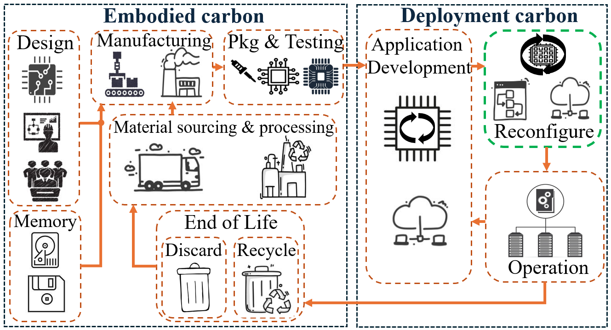

# GreenFPGA

GreenFPGA is a comprehensive framework for estimating the CFP of FPGAs over their lifecycle, considering uncertainties inherent in CFP modeling. The framework evaluates lifecycle CFP by accounting for the impacts of design, manufacturing, reconfigurability (reuse), operation, testing, disposal, and recycling. Using GreenFPGA, we evaluate scenarios in which the reconfigurability of FPGAs offsets embodied and operational CFP costs compared to application-specific integrated circuits (ASICs), graphics processing units (GPUs), and central processing units (CPUs). Additionally, we emphasize the importance of analyzing CFP across four platforms—FPGA, ASIC, GPU, and CPU while incorporating variables such as lifetime, usage time, volume, and number of applications. 

  


## Abstract
Modeling the carbon footprint (CFP) of computing includes both the operational CFP from the use of semiconductor devices and the embodied CFP from their manufacture and design has become essential for sustainability.  Field Programmable Gate Arrays (FPGAs) emerge as promising sustainable platforms due to their reconfigurability, allowing the embodied CFP to be amortized across multiple applications. This work introduces GreenFPGA, a framework for estimating the FPGA’s CFP across the lifespan, considering the uncertainties in CFP modeling. The framework evaluates the lifecycle CFP by accounting for the impacts of design, manufacturing, reconfigurability (reuse), operation, testing, disposal, and recycling. Using the GreenFPGA framework, the work evaluates scenarios where the reconfigurability of FPGAs helps outweigh the embodied and operational CFP costs compared to application-specific integrated circuits (ASICs), graphics processing units (GPUs), and central processing units (CPUs). The work emphasizes the importance of analyzing the CFP across four platforms—FPGA, ASIC, GPU, and CPU—by considering multiple parameters, including lifetime, usage time, volume, and the number of applications.


## Getting started

### Setup guide

GreenFPGA requires the following: 

```
- python 3.8 
- pip 20.0.2
- python3.8-venv
```

Additionally, please refer steps below that provide instructions to install the packages inside requirements.txt in a virtual environment. 

### Steps to install with bash

```
git clone https://github.com/ASU-VDA-Lab/GreenFPGA.git
cd GreenFPGA
python3 -m venv greenfpga
source greenfpga/bin/activate
pip3 install -r requirements.txt
```

## Key parameters
GreenFPGA uses input parameters from the JSON files under the test_examples and computes the CFP for multiple scenarios and multiple device platforms (FPGA, ASIC, GPU, and CPU).  

  

### Specification Parameters 
All the important specification parameters of the FPGA, ASIC, GPU, and CPU are added to the [fpga_spec.json](./test_example/Agilex/fpga_spec.json). The file contains important parameters such as area of the design (mm2), power of the design (W), number of manufactured parts (Volume), lifetime of the evaluation (hrs), and based on the type of experiment and device type that we are analyzing, number of applications and number of designs are provieded as inputs in the [fpga_spec.json](./test_example/Agilex/fpga_spec.json).


The [node_list.txt](./test_example/TPU/node_list.txt) comprises the technology node associated with the design that needs to be analyzed. We have added example for each of the platforms (ASIC, FPGA, GPU, and CPU) under [test_example](./test_example/) directory. 

The remaining parameters regarding the design CFP, application-development CFP, EOL CFP, memory CFP, and testing CFP are all provided in [green_fpga_param.json](./test_example/TPU/green_fpga_param.json) based on user preferences. 

```     
   ├── fpga_spec.json
   ├── node_list.txt
   └── green_fpga_param.json
```

GreenFPGA tool can also accept parameters from the command line. Below are some of the main parameters that could be used to help sweep and analyze the variations in embodied and operational CFP.  


```
--design_dir    : Directory for design analysis 
--num_app       : Number of application  
--num_lifetime  : Total evaluation lifetime 
--node          : Tech node of analysis 
--mem_cap       : Memory capacity 
--dc_val        : DC Value
--num_des       : Number of designs needed to run the experiment
--nfpga         : Number of FPGAs, Appsize/fpga_capacity 
--power         : Power of the device under analysis
--chip_area     : Area of the device 
--ope_vol       : Opertaion Volume 
--emb_vol       : Embodied Volume
--uncertain_off : Uncertianity analysis off 
```
Commands to run GreenFPGA with these parameters are provided in the next section below. 

## Running GreenFPGA
Modify the input parameters according to the design and experiment being analyzed. 
The command to run GreenFPGA to obtain the breakdown of CFP for the design : 
```
python3 src/ECO_chip.py --design_dir test_example/TPU/
```
To run the analysis using command line parameters : 
```
python3 src/ECO_chip.py --design_dir test_example/TPU/ --num_des 1 --num_app 5 --num_lifetime 8 --power 150 --chip_area 650
python3 src/ECO_chip.py --design_dir test_example/Agilex/ --num_des 3 --num_app 3 --num_lifetime 5 --power 80  --chip_area 450
```

To run probabilistic model the source code is present under [probabilistic](./src/uncertainity/) directory. It contains all the functions and code base required to help run the probaiblistic analysis. The code generates the required KDE and other distributions for important parameters accounting for the inherent uncertainities such as spatial, temporal, process-driven and system-driven variations that impact both embodied and opertional carbon footprint (CFP). Below is an example of the KDE for Carbon Intensity variation:

 


## Table of Contents

-   [Directory structure](#directory-structure)
-   [Getting started](#getting-started)
-   [Key parameters](#key-parameters)
-   [Running GreenFPGA](#running-greenfpga)
-   [Outputs](#outputs)

## Directory Structure 

- **src/**
  - [CO2_func.py](./src/CO2_func.py)
  - [ECO_chip.py](./src/ECO_chip.py)
  - [tech_scaling.py](./src/tech_scaling.py)
- **tech_params**
  - [beol_feol_scaling.json](./tech_params/beol_feol_scaling.json)
  - [cpa_scaling.json](./tech_params/cpa_scaling.json)
  - [defect_density.json](./tech_params/defect_density.json)
  - [dyn_pwr_scaling.json](./tech_params/dyn_pwr_scaling.json)
- [README.md](README.md)
- **test_example**
  - **Agilex**
    - [fpga_spec.json](./test_example/Agilex/fpga_spec.json)
    - [green_fpga_param.json](./test_example/Agilex/green_fpga_param.json)
    - [node_list.txt](./test_example/Agilex/node_list.txt)
  - **ASIC_analysis**
    - [fpga_spec.json](./test_example/ASIC_analysis/fpga_spec.json)
    - [green_fpga_param.json](./test_example/ASIC_analysis/green_fpga_param.json)
    - [node_list.txt](./test_example/ASIC_analysis/node_list.txt)
  - **FPGA_analysis**
    - [fpga_spec.json](./test_example/FPGA_analysis/fpga_spec.json)
    - [green_fpga_param.json](./test_example/FPGA_analysis/green_fpga_param.json)
    - [node_list.txt](./test_example/FPGA_analysis/node_list.txt)
  - **Moffett**
    - [fpga_spec.json](./test_example/Moffett/fpga_spec.json)
    - [green_fpga_param.json](./test_example/Moffett/green_fpga_param.json)
    - [node_list.txt](./test_example/Moffett/node_list.txt)
  - **Stratix**
    - [fpga_spec.json](./test_example/Stratix/fpga_spec.json)
    - [green_fpga_param.json](./test_example/Stratix/green_fpga_param.json)
    - [node_list.txt](./test_example/Stratix/node_list.txt)
  - **TPU**
    - [fpga_spec.json](./test_example/TPU/fpga_spec.json)
    - [green_fpga_param.json](./test_example/TPU/green_fpga_param.json)
    - [node_list.txt](./test_example/TPU/node_list.txt)
- **images**
  - [asic_fpga_app.png](./images/asic_fpga_app.png)
  - [dnn.png](./images/dnn.png)
  - [fpga-ligecycle.png](./images/fpga-lifecycle.png)
  - [greenfpga-arch.png](./images/greenfga-arch.png)


The resulting anaylsis is shown below in the box plot, with variations in CFP values for FPGA and ASIC for each of the entry on the X-axis. 

## Outputs
Below is an example output for a test_example TPU showing the breakdown in Total CFP :
```
-------------------------
Using below files 
test_example/TPU/green_fpga_param.json
test_example/TPU/fpga_spec.json
test_example/TPU/node_list.txt
-------------------------
-------------------------
Design    CFP : 2.590000e+07
Mfg       CFP : 3.141413e+08
EOL       CFP : 3.900000e+03
Operation CFP : 1.098548e+09
App Dev   CFP : 5.040000e+01
-------------------------
Embodied  CFP : 3.400452e+08
Operation CFP : 1.098548e+09
-------------------------
Total     CFP : 1.438593e+09
-------------------------
```

The variation in CFP for some parameter sweep exploration is shown for a DNN test case below. 

  

 
The extra embodied CFP that comes with manufacturing FPGA can be amortized across its multiple applications due to its ability to re-configure and its extended life for an iso-performance DNN application. A savings of 25% CFP can be seen using FPGAs compared to ASIC. 


  


## Citation
If you find GreenFPGA useful or relevant to your research, please kindly cite our paper:
```
@inproceedings{sudarshan2023greenfpga,
      author = {Choppali Sudarshan, Chetan and Arora, Aman and Chhabria, Vidya A.},
      title = {GreenFPGA: Evaluating FPGAs as Environmentally Sustainable Computing Solutions},
      year = {2024},
      isbn = {9798400706011},
      publisher = {Association for Computing Machinery},
      address = {New York, NY, USA},
      url = {https://doi.org/10.1145/3649329.3657343},
      doi = {10.1145/3649329.3657343},
      articleno = {320},
      numpages = {6},
      location = {San Francisco, CA, USA},
      series = {DAC '24}
}
```
